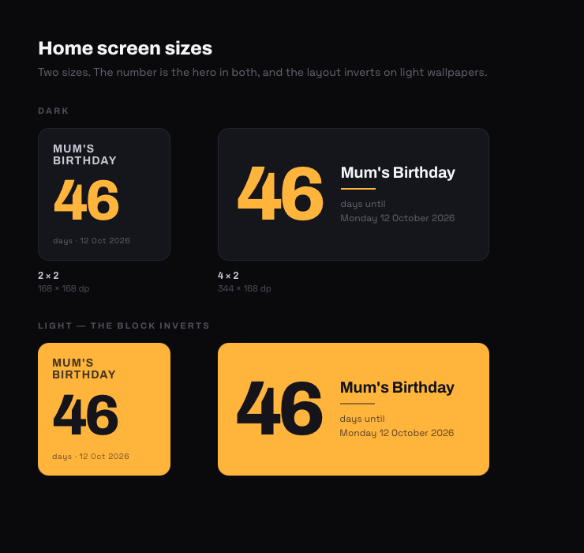
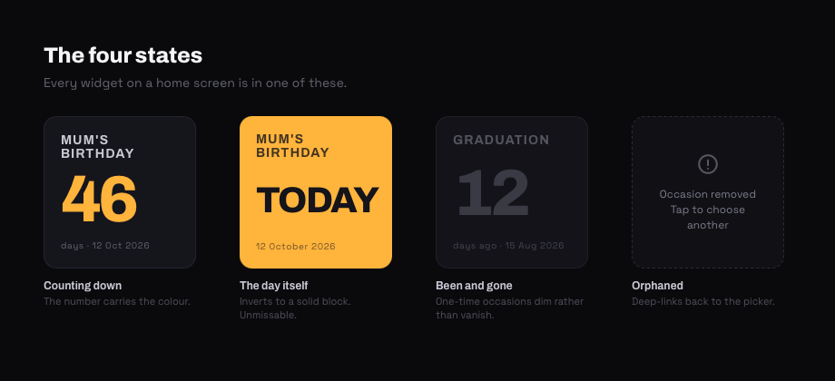
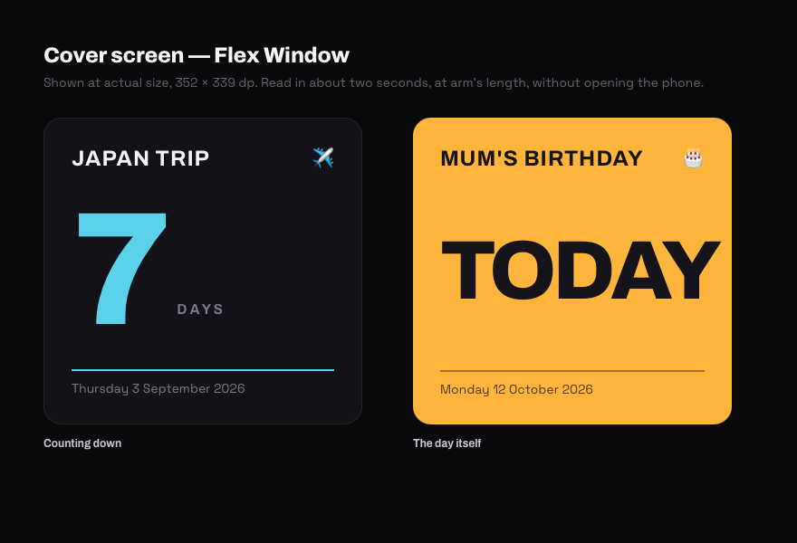
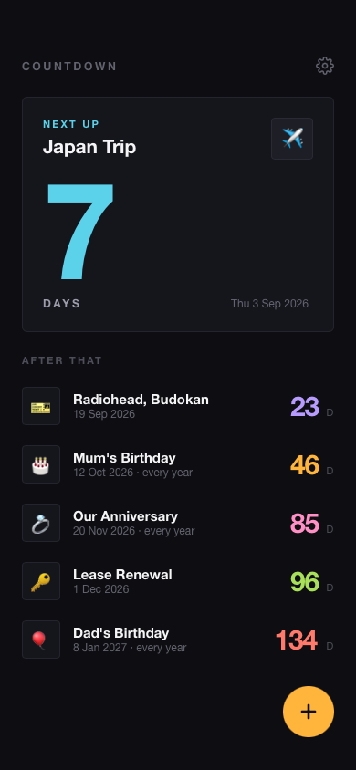
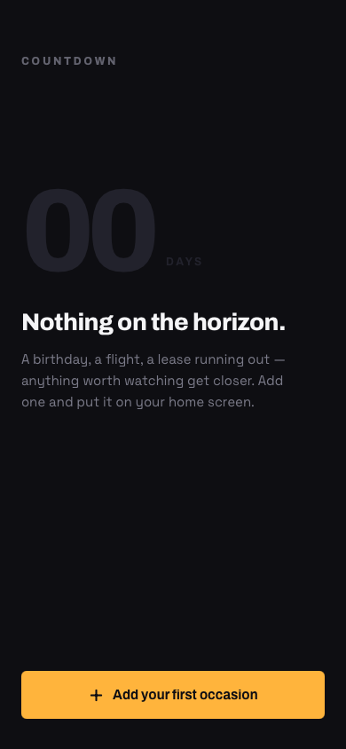
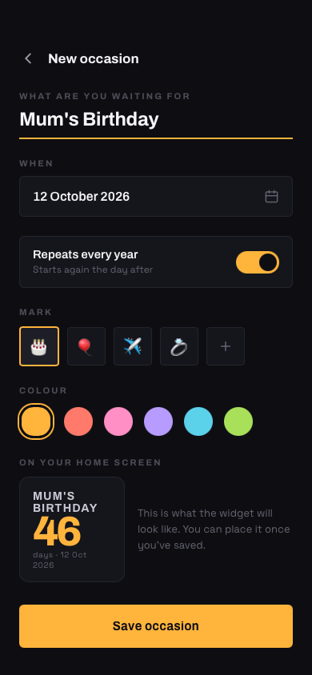
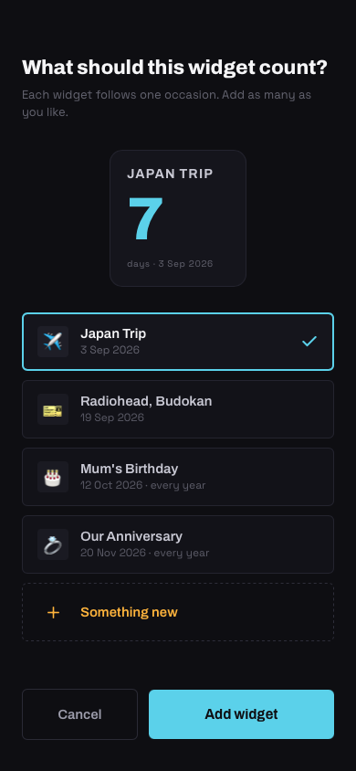

# Countdown

An Android app for counting down to the things you're actually waiting for — a birthday, a
flight, a lease running out — and putting each one on your home screen as its own widget.

The widgets are the product. The app exists to feed them.

## Purpose

You create an **occasion** — a title, a date, a colour — and place it on your home screen as its
own widget. Several occasions, several widgets, each counting independently. The day count is the
hero at every size, and on the day itself the widget inverts to a solid block of that colour so
you can't miss it. On a Galaxy Z Flip it goes on the [cover screen](#cover-screen-samsung-flex-window)
too.

## Tech stack

| Layer | Choice | Notes |
|---|---|---|
| Language | Kotlin 2.0.21 | |
| App UI | Jetpack Compose, Material 3 | Compose BOM 2024.06.00 |
| Widgets | **Jetpack Glance 1.1.0** | Compose-style API over `RemoteViews` |
| Persistence | Room 2.6.1 (KSP) | `countdown.db`, schema exported to `app/schemas/` |
| Per-widget state | DataStore, via Glance's `PreferencesGlanceStateDefinition` | |
| Scheduling | `AlarmManager`, **inexact** | See [Refresh](#what-triggers-a-refresh) |
| Build | AGP 8.5.2, Gradle 8.9, JDK 17 | `compileSdk` 34, `minSdk` 26 |

No dependency injection framework, no navigation library, no `ViewModel`s. The dependency graph
is one repository hung off `Application`, and screen switching is a single `Long` in
`rememberSaveable`. At this size those libraries would cost more than they'd return.

### Constraints Glance imposes

Worth knowing before changing any widget layout, because none of these fail loudly:

- No shadows, gradients, arcs, custom drawing or animation. Only solid backgrounds, rounded
  corners, rows, columns, text and images.
- No letter-spacing, and font weights stop at `Bold` — no `Black`.
- `cornerRadius(dp)` needs API 31; below that corners are square.

The design leans on colour contrast rather than effects for exactly this reason.

## Data model

### `Occasion` — `data/Occasion.kt`

The only persisted entity. One row per thing you're waiting for.

| Field | Column | Type | Notes |
|---|---|---|---|
| `id` | `id` | `Long` | Autogenerated primary key |
| `title` | `title` | `String` | |
| `date` | `date` | `LocalDate` | Stored as an **epoch day**, not a timestamp — an occasion is a date, not a moment |
| `recurringYearly` | `recurring_yearly` | `Boolean` | If set, the countdown rolls to next year the day after it passes |
| `emoji` | `emoji` | `String?` | Optional mark, user-chosen |
| `accentColor` | `accent_color` | `Int` | ARGB. Plain `Int` so the app and the widget can share it without Compose or Glance types |
| `isDeleted` | `is_deleted` | `Boolean` | **Tombstone, not a hard delete** — see below |
| `createdAt` | `created_at` | `Long` | |

Deletes are soft because widgets outlive the app's screens. A widget holds an occasion id; if the
row simply vanished, the widget would render blank with no way back. Instead it detects the
tombstone and offers to be repointed.

### `CountdownState` — `domain/Countdown.kt`

Not persisted. The resolved answer to "how far away is this, today?"

```kotlin
sealed interface CountdownState {
    val target: LocalDate                                   // the date actually counted to
    data class Upcoming(val days: Long, ...) : CountdownState
    data class Today(...) : CountdownState
    data class Past(val daysAgo: Long, ...) : CountdownState
}
```

`target` is *not* always `Occasion.date`: for a yearly occasion it's the next occurrence, which
may be in a different year than the date the user typed.

### Per-widget state

Each widget instance stores one key in its own slice of Glance's DataStore:

```kotlin
object WidgetPrefs { val OccasionId = longPreferencesKey("occasion_id") }
```

This is what makes multiple independent widgets work. It is keyed by `GlanceId`, so widget #3 and
widget #7 can point at different occasions with no shared state.

## How the data flows

There are **two independent stores**, and neither knows about the other:

```
   Room (countdown.db)                  Glance DataStore (per widget)
   ┌──────────────────┐                 ┌───────────────────────────┐
   │  occasions       │                 │ GlanceId → occasion_id    │
   │  - what they are │                 │ - which one each widget   │
   │  - when they are │                 │   is showing              │
   └──────────────────┘                 └───────────────────────────┘
```

They are joined at render time, inside the widget's composition. Everything below is a
consequence of that split.

```
                          OccasionRepository
                                  │
        ┌─────────────────────────┼──────────────────────────┐
        │                         │                          │
   observeAll()              observeById(id)            save() / delete()
        │                         │                          │
        ▼                         ▼                          ▼
  OccasionListScreen        CountdownWidget          Room write, then
  (Flow → Compose)          (Flow → Glance)          CountdownWidget().updateAll()
```

### Reading — the app

`OccasionListScreen` collects `repository.observeAll()` as Compose state, then maps every row
through `Countdown.stateFor(date, recurringYearly, today)` and sorts by `Countdown.sortKey`.

Sorting happens **in Kotlin, not SQL**. A yearly occasion's next occurrence depends on today's
date, which SQLite can't compute, so the DAO deliberately returns rows unordered.

### Reading — a widget

```
launcher / alarm
      │
      ▼
GlanceAppWidgetReceiver ──► CountdownWidget.provideGlance(context, id)
                                    │
                                    ├─ resolve appWidgetId  (for the orphan deep-link)
                                    │
                                    └─ provideContent {
                                          currentState(WidgetPrefs.OccasionId)   ← reactive
                                              │
                                              ▼
                                          repository.observeById(id)             ← reactive
                                              │
                                              ▼
                                          Loading | Unbound | Ready(occasion)
                                              │
                                              ▼
                                          Countdown.stateFor(..., LocalDate.now())
                                              │
                                              ▼
                                          Medium | Wide | Cover layout
                                       }
```

**Both reads happen inside `provideContent`, and that is load-bearing.** Glance's
`AppWidgetSession` does `remember { widget.runGlance(context, id) }` — so `provideGlance`'s body
runs exactly *once* per session. A later `update()` refreshes `LocalState` and recomposes but
does **not** re-run `provideGlance`. Anything read into a local variable above `provideContent`
is frozen at session start.

That matters because a widget dropped from the picker starts its session *before* the
configuration activity has written the occasion id. Reading above the composition meant the
widget captured `null` and rendered "Occasion removed" forever. (This was a real bug; see commit
`427c14f`.)

### Writing — editing an occasion

```
OccasionEditScreen ──► repository.save(occasion) ──► dao.insert/update
                                                          │
                                                          ├─► Room Flow emits
                                                          │   (live widget sessions recompose)
                                                          └─► CountdownWidget().updateAll()
                                                              (idle widgets get a fresh session)
```

### Writing — binding a widget to an occasion

Both entry points funnel through one function, `bindWidget` in `widget/WidgetBinding.kt`:

```
A. From the widget picker           B. From "Add to home screen"
   launcher allocates appWidgetId      requestPinWidget(context, occasionId)
   → CountdownWidgetConfigActivity     → launcher places the widget
   → user picks an occasion            → fires our PendingIntent
   → setResult(RESULT_OK)              → WidgetPinnedReceiver
          │                                      │
          └──────────────┬───────────────────────┘
                         ▼
              bindWidget(context, appWidgetId, occasionId)
                         │
                         ├─ GlanceAppWidgetManager.getGlanceIdBy(appWidgetId)
                         ├─ updateAppWidgetState { occasion_id = occasionId }
                         └─ CountdownWidget().update(context, glanceId)
```

The `getGlanceIdBy` line is the awkward seam of the whole codebase: the framework deals in
`appWidgetId` (an `Int`), Glance keys state by `GlanceId`. Everything that creates a widget must
cross that bridge, which is why it lives in exactly one place.

### What triggers a refresh

The number only changes at midnight, but plenty of other things invalidate a rendered widget:

| Trigger | Path |
|---|---|
| Local midnight | `MidnightAlarmScheduler` → `MidnightReceiver` → `updateAll()` + reschedule |
| Reboot | `BOOT_COMPLETED` (alarms don't survive one) |
| Clock or time zone changed | `TIME_SET`, `TIMEZONE_CHANGED` |
| App updated | `MY_PACKAGE_REPLACED` |
| App resumed | `MainActivity.onResume()` — insurance against Doze deferring the alarm |
| Occasion edited | `OccasionRepository.save()` / `delete()` |

The daily alarm is **inexact** (`setAndAllowWhileIdle`). `SCHEDULE_EXACT_ALARM` is denied by
default from Android 14 and Google Play restricts exact-alarm permissions to alarm-clock and
calendar class apps; a countdown neither qualifies nor needs the precision. `ACTION_DATE_CHANGED`
is deliberately *not* used — it isn't reliably delivered to manifest-registered receivers from
Android 8.

### Time zones

`Countdown.stateFor` takes `today` as a parameter rather than reading the clock. Time zone is
therefore the caller's concern (`LocalDate.now()` at every call site), and the arithmetic is a
pure function that can be tested without a device.

All day arithmetic is `ChronoUnit.DAYS.between` on `LocalDate`, never millisecond subtraction —
a DST transition makes some local days 23 or 25 hours long.

## Widget sizes

| Size | Dimensions | Notes |
|---|---|---|
| 2×2 | 168 × 168 dp | The minimum. `minWidth`/`minResizeWidth` are 110dp so nothing smaller can be placed |
| 4×2 | 344 × 168 dp | Number left, title and full date right |
| Cover | 352 × 339 dp | Samsung Flex Window |

`SizeMode.Responsive` picks between them; `updatePeriodMillis` is `0` because refreshes are
driven by our own alarm.

### Cover screen (Samsung Flex Window)

The Z Flip cover screen only lists widgets that have opted in, via a second, Samsung-specific
meta-data entry alongside the standard one:

```xml
<meta-data android:name="com.samsung.android.appwidget.provider"
           android:resource="@xml/samsung_countdown_widget_info" />
```
```xml
<samsung-appwidget-provider display="sub_screen" />
```

Documented at [developer.samsung.com/galaxy-z/flex_window.html](https://developer.samsung.com/galaxy-z/flex_window.html).
A separate receiver (`CountdownCoverWidgetReceiver`) carries it, at `widgetCategory="keyguard"`
and the Flex Window's size, rendering the same `CountdownWidget`.

> **Unverified on hardware.** Samsung's documentation is Flip 5 / One UI 5.1.1 era. The
> declaration is confirmed to survive resource compilation, but there is no cover screen in the
> emulator, so whether One UI 9 still honours it can only be established on a device.

## Project layout

```
app/src/main/java/com/liana/countdown/
  CountdownApp.kt                 Application; owns the repository, schedules the alarm
  domain/Countdown.kt             Pure date arithmetic — the only unit-tested logic
  data/
    Occasion.kt                   Entity, accent palette, mark list
    OccasionDao.kt                Queries (observeAll, observeById, soft delete)
    CountdownDatabase.kt          Room database + LocalDate converters
    OccasionRepository.kt         The single read/write surface; refreshes widgets on write
  ui/
    MainActivity.kt               Screen switching, resume-time refresh
    OccasionListScreen.kt         List, "next up" hero, empty state
    OccasionEditScreen.kt         Create/edit form, live widget preview, pin button
    Components.kt, theme/         Buttons, palette, type scale
  widget/
    CountdownWidget.kt            GlanceAppWidget; all three size layouts
    Receivers.kt                  Home-screen and cover-screen providers
    CountdownWidgetConfigActivity.kt   Runs when a widget is placed
    WidgetBinding.kt              bindWidget, requestPinWidget, pin callback receiver
    WidgetPrefs.kt                Per-widget DataStore keys
  work/MidnightAlarmScheduler.kt  Daily tick + boot/clock/timezone receiver

app/src/test/java/.../CountdownTest.kt    14 tests over the date arithmetic
```

## Building

```bash
export JAVA_HOME=$(/usr/libexec/java_home -v 17)
./gradlew :app:assembleDebug
./gradlew :app:testDebugUnitTest
./gradlew :app:installDebug      # with a device or emulator attached
```

Or open the project root in Android Studio.

### Tests

`CountdownTest` covers the date arithmetic, which is where the bugs would otherwise be:

- Yearly occasions rolling to next year the day after they pass, and never reporting as past
- **29 February** clamping to the 28th in a common year, and staying on the 29th in a leap year
- Leap days falling *inside* a counted span
- Crossing the date line, where the same instant legitimately gives two different answers
- Ordering: today first, past occasions last

## The look

### Widgets







### App

| Occasions | Empty state | New occasion | Widget setup |
|:--:|:--:|:--:|:--:|
|  |  |  |  |

Widgets in place on a home screen: [design canvas](https://claude.ai/code/artifact/ca67420e-4d48-49c8-9c0d-5e3bc7c1bba7)
